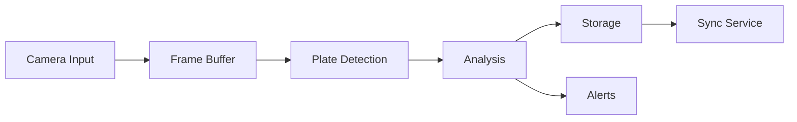

# System Architecture

## Overview
The License Plate Detection and Following Vehicle Analysis System is built on a modular architecture designed for reliability, scalability, and real-time processing.

## System Components

### 1. Core Components
```
[Camera Module] → [Detection Engine] → [Analysis Engine] → [Storage Engine]
                                   ↓
                            [Alert System]
```

#### Camera Module
- Handles real-time video capture
- Manages frame buffering
- Implements frame optimization
- Handles camera configuration

#### Detection Engine
- Processes video frames
- Implements Nomeroff-net integration
- Handles plate recognition
- Manages detection confidence

#### Analysis Engine
- Processes detection patterns
- Implements following vehicle analysis
- Manages temporal analysis
- Handles pattern matching

#### Storage Engine
- Manages database operations
- Handles data synchronization
- Implements data retention policies
- Manages backup operations

### 2. Data Flow


### 3. Component Interactions

#### Real-time Processing Pipeline
1. Frame Acquisition
   ```python
   class FrameAcquisition:
       def __init__(self):
           self.buffer_size = 30
           self.frame_buffer = deque(maxlen=self.buffer_size)

       async def process_frame(self, frame):
           self.frame_buffer.append(frame)
           return await self._optimize_frame(frame)
   ```

2. Detection Pipeline
   ```python
   class DetectionPipeline:
       def __init__(self):
           self.detector = PlateDetector()
           self.confidence_threshold = 0.5

       async def process(self, frame):
           detections = await self.detector.detect(frame)
           return [d for d in detections if d.confidence > self.confidence_threshold]
   ```

3. Analysis Pipeline
   ```python
   class AnalysisPipeline:
       def __init__(self):
           self.analyzer = PatternAnalyzer()
           self.alert_manager = AlertManager()

       async def analyze(self, detections):
           patterns = await self.analyzer.find_patterns(detections)
           if patterns:
               await self.alert_manager.check_patterns(patterns)
           return patterns
   ```

## Performance Considerations

### 1. Resource Management
- Frame buffer optimization
- Memory management
- CPU utilization
- I/O optimization

### 2. Scalability
- Horizontal scaling capabilities
- Load balancing
- Distributed processing
- Database sharding

### 3. Reliability
- Error handling
- Failover mechanisms
- Data redundancy
- System recovery

## System Requirements

### Hardware Requirements
```yaml
raspberry_pi:
  model: "5"
  ram: "8GB"
  storage: "32GB+"
  camera: "V3 Module"
  cooling: "Active"

network:
  bandwidth: "10Mbps+"
  latency: "<50ms"
  stability: "Required"
```

### Software Requirements
```yaml
operating_system:
  name: "Raspberry Pi OS"
  version: "64-bit"
  kernel: "6.1+"

python:
  version: "3.8+"
  packages:
    - opencv-python
    - numpy
    - sqlite3
    - nomeroff-net
```

## Configuration Management

### 1. System Configuration
```yaml
system:
  processing:
    frame_skip: 2
    buffer_size: 30
    batch_size: 10
  
  analysis:
    window_size: 30  # minutes
    min_detections: 5
    confidence_threshold: 0.5
```

### 2. Performance Configuration
```yaml
performance:
  cpu_allocation: 80
  memory_limit: 70
  storage_quota: 90
  cleanup_interval: 86400
```

## Monitoring and Logging

### 1. Metrics Collection
- System performance metrics
- Detection statistics
- Analysis results
- Resource utilization

### 2. Logging System
```python
LOGGING_CONFIG = {
    'version': 1,
    'handlers': {
        'file': {
            'class': 'logging.handlers.RotatingFileHandler',
            'filename': 'system.log',
            'maxBytes': 10485760,
            'backupCount': 5
        }
    },
    'root': {
        'level': 'INFO',
        'handlers': ['file']
    }
}
```

## Security Architecture

### 1. Access Control
- Role-based access control
- Authentication system
- Authorization policies
- Session management

### 2. Data Security
- Encryption at rest
- Secure communication
- Data integrity checks
- Audit logging

## Deployment Architecture

### 1. Single Node Deployment
```
[Raspberry Pi]
├── Camera Module
├── Detection System
├── Analysis System
└── Database
```

### 2. Distributed Deployment
```
[Master Node]
├── Orchestration
├── Load Balancer
└── Primary Database

[Worker Nodes]
├── Camera Module
├── Detection System
└── Analysis System
```

Would you like me to continue with the next documentation file or expand any section of this one?